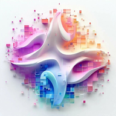
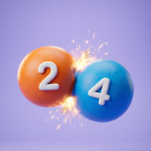
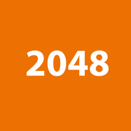

<div align="center">


[](https://github.com/4isper)

</div>

---

## 🧰 Stack


## 📱 Apps

<table>
  <tr>
    <td width="50%" valign="top">
      <a href="https://apkpure.com/p/com.m4isper.rezify"><b> Rezify</b></a><br>
      <sub>AI photo enhancer — fully offline, on-device processing</sub>
    </td>
    <td width="50%" valign="top">
      <a href="https://apkpure.com/p/com.m4isper.robotfactory"><b> Robot Factory: idle clicker</b></a><br>
      <sub>Idle factory automation sim with prestige, artifacts and offline progress</sub>
    </td>
  </tr>
  <tr>
    <td width="50%" valign="top">
      <a href="https://apkpure.com/p/com.m4isper.gravity2048"><b> Gravity 2048</b></a><br>
      <sub>2048 with real physics — throw falling balls, chain merges</sub>
    </td>
    <td width="50%" valign="top">
      <a href="https://apkpure.com/p/com.m4isper.merge2048"><b> 2048 Merge</b></a><br>
      <sub>Minimalist classic 2048 with smooth animations and dark theme</sub>
    </td>
  </tr>
</table>

## 🛠️ Open Source

<table>
  <tr>
    <td width="50%" valign="top">
      <a href="https://github.com/4isper/Mocksy"><b>🖥️ Mocksy</b></a>
      <a href="https://mocksy-ashen.vercel.app"></a><br>
      <sub>Browser-based mockup editor, 100% client-side — frames, annotations, animations, PNG/MP4/GIF export</sub>
    </td>
    <td width="50%" valign="top">
      <a href="https://github.com/4isper/KMPMLBench"><b>⚡ KMPMLBench</b></a><br>
      <sub>Cross-platform ML performance lab for Kotlin Multiplatform — benchmarks TFLite, ONNX, NCNN, MNN, ExecuTorch</sub>
    </td>
  </tr>
</table>

## 📊 GitHub Stats

<div align="center">
  <picture>
    <source media="(prefers-color-scheme: dark)" srcset="https://github-readme-stats.vercel.app/api?username=4isper&show_icons=true&hide_border=true&bg_color=00000000&title_color=a9fefe&icon_color=a9fefe&text_color=c9d1d9" />
    <source media="(prefers-color-scheme: light)" srcset="https://github-readme-stats.vercel.app/api?username=4isper&show_icons=true&hide_border=true&bg_color=00000000" />
    
  </picture>
  <a href="https://github.com/4isper">
    
  </a>
</div>

<div align="center">
  <picture>
    <source media="(prefers-color-scheme: dark)" srcset="https://github-readme-stats.vercel.app/api/top-langs/?username=4isper&layout=compact&hide_border=true&bg_color=00000000&title_color=a9fefe&text_color=c9d1d9" />
    <source media="(prefers-color-scheme: light)" srcset="https://github-readme-stats.vercel.app/api/top-langs/?username=4isper&layout=compact&hide_border=true&bg_color=00000000" />
    
  </picture>
  <picture>
    <source media="(prefers-color-scheme: dark)" srcset="https://github-readme-activity-graph.vercel.app/graph?username=4isper&bg_color=00000000&color=a9fefe&line=58a6ff&point=c9d1d9&hide_border=true" />
    <source media="(prefers-color-scheme: light)" srcset="https://github-readme-activity-graph.vercel.app/graph?username=4isper&hide_border=true" />
    
  </picture>
</div>

## ⏱️ Coding Activity

<!--START_SECTION:waka-->

```txt
From: 27 May 2023 - To: 25 August 2026

Total Time: 1,425 hrs 14 mins

Kotlin                 702 hrs 19 mins       ⣿⣿⣿⣿⣿⣿⣿⣿⣿⣿⣿⣿⣤⣀⣀⣀⣀⣀⣀⣀⣀⣀⣀⣀⣀   49.05 %
Python                 197 hrs 46 mins       ⣿⣿⣿⣦⣀⣀⣀⣀⣀⣀⣀⣀⣀⣀⣀⣀⣀⣀⣀⣀⣀⣀⣀⣀⣀   13.81 %
JavaScript             170 hrs 36 mins       ⣿⣿⣿⣀⣀⣀⣀⣀⣀⣀⣀⣀⣀⣀⣀⣀⣀⣀⣀⣀⣀⣀⣀⣀⣀   11.91 %
TypeScript             107 hrs 42 mins       ⣿⣷⣀⣀⣀⣀⣀⣀⣀⣀⣀⣀⣀⣀⣀⣀⣀⣀⣀⣀⣀⣀⣀⣀⣀   07.52 %
C++                    58 hrs 12 mins        ⣿⣀⣀⣀⣀⣀⣀⣀⣀⣀⣀⣀⣀⣀⣀⣀⣀⣀⣀⣀⣀⣀⣀⣀⣀   04.07 %
TOML                   27 hrs 10 mins        ⣦⣀⣀⣀⣀⣀⣀⣀⣀⣀⣀⣀⣀⣀⣀⣀⣀⣀⣀⣀⣀⣀⣀⣀⣀   01.90 %
CSS                    25 hrs 40 mins        ⣦⣀⣀⣀⣀⣀⣀⣀⣀⣀⣀⣀⣀⣀⣀⣀⣀⣀⣀⣀⣀⣀⣀⣀⣀   01.79 %
Markdown               23 hrs 27 mins        ⣤⣀⣀⣀⣀⣀⣀⣀⣀⣀⣀⣀⣀⣀⣀⣀⣀⣀⣀⣀⣀⣀⣀⣀⣀   01.64 %
XML                    20 hrs 51 mins        ⣤⣀⣀⣀⣀⣀⣀⣀⣀⣀⣀⣀⣀⣀⣀⣀⣀⣀⣀⣀⣀⣀⣀⣀⣀   01.46 %
HTML                   15 hrs 43 mins        ⣤⣀⣀⣀⣀⣀⣀⣀⣀⣀⣀⣀⣀⣀⣀⣀⣀⣀⣀⣀⣀⣀⣀⣀⣀   01.10 %
```

<!--END_SECTION:waka-->

---

<div align="center">
  
</div>
